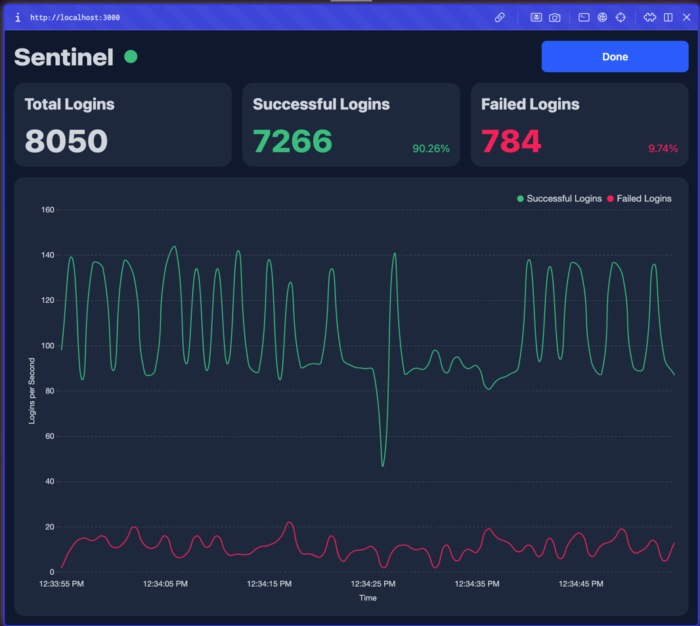

# 🛡️ Sentinel

Sentinel is a high-frequency real-time monitoring dashboard built with SolidJS and Firebase.

## The Origin Story

What started as a random YouTube recommendation about SolidJS turned into a deep dive into high-throughput data
architectures. I asked Gemini for a project idea to test SolidJS's reactivity, and Sentinel was born.

## The Challenge: Scaling to $\gamma = 10,000$

The original concept was simple: click a button, generate $\gamma = 300$ Firestore documents, and watch the dashboard
update. But things got interesting when I pushed the limit to 10,000 documents (clamped to protect my credit card from
the Firebase free-tier limits).

### Problem 1: Backend Meltdown

A single backend instance couldn't handle the burst of 10k writes in a single request.

- The Fix: Decoupled the architecture. The backend now pushes to Pub/Sub, and a dedicated Ingestor Service consumes the
  messages at an optimal pace to handle the Firestore writes.

### Problem 2: Frontend "Jank"

Even with the backend fixed, the frontend began to hang. Processing 10k Firestore record changes in the browser's main
thread locked the UI, dropping frames and killing responsiveness.

- The Fix: Implemented Web Workers. By moving the Firestore subscription and data parsing into a background thread, the
  UI stays a buttery-smooth 60fps while the worker handles the heavy lifting.

# Tech Stack

- Frontend: SolidJS (for fine-grained reactivity)

- Frontend Background Processing: Web Workers (to prevent Main Thread blocking)

- Backend: Java Spring Boot
    - https://github.com/Abhiroop25902/chatapp-backend
    - https://github.com/Abhiroop25902/sentinel-ingestor

- Infrastructure: Google Cloud Pub/Sub & Cloud Run

- Database: Cloud Firestore

